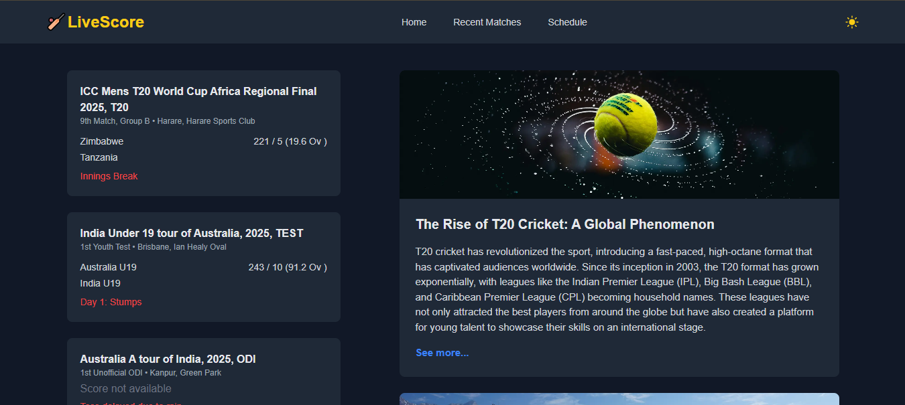

# Live Cricket Score App (Next.js)

## 📚 Table of Contents

- [Description](#-description)
- [Live Demo](#-live-demo)
- [Features](#-features)
- [Tech Stack](#️-tech-stack)
- [Setup and Installation](#️-setup-and-installation)
- [Environment Variables](#-environment-variables)
- [Author Info](#-author-info)

## 📝 Description

I developed a Live Cricket Score Application using Next.js and the Cricbuzz API from RapidAPI. This app provides real-time cricket updates with a clean and responsive UI. It allows users to stay updated with live matches, recent results, upcoming fixtures, and cricket articles.

A scorecard section is also implemented to show detailed match score information. Since the free version of the Cricbuzz API allows only 100 requests per day, I optimized the features to cover the most important sections without overusing API calls.

## 🚀 Live Demo

[](https://cricket-live-application-z7ba-nxas4d6u0.vercel.app/)

## ✨ Features

#### `Live Matches`

- Displays real-time cricket scores for ongoing matches.
- Includes international cricket coverage.

#### `Recent Matches`

- View recently finished matches with results.

#### `Upcoming Matches`

- Stay updated on upcoming fixtures.

#### `Scorecard Section`

- Provides detailed score breakdown for selected matches.

## 🛠️ Tech Stack

- **`Frontend:`** Next.js 14, JavaScript, Tailwind CSS, React Icons, Axios
- **`API:`** Cricbuzz API (via RapidAPI)

## ⚙️ Setup and Installation

### Step-by-step instructions for cloning and running locally:

```
✅ git clone https://github.com/Mohosin999/Live-Cricket-Score-App-Next.js.git

✅ cd Live-Cricket-Score-App-Next.js

✅ npm install

✅ npm run dev
```

## 🔑 Environment Variables

Create a `.env` file in the root directory of the project and add the following variables:

```
NEXT_PUBLIC_RAPIDAPI_KEY=

NEXT_PUBLIC_API_BASE_URL=
```

## 📬 Author Info

👤 **Mohosin Hasan Akash**

- 💼 **LinkedIn:** [linkedin.com/in/mohosinh99/](https://www.linkedin.com/in/mohosinh99/)
- 🌐 **Portfolio:** [personal-portfolio.com](https://personal-portfolio-website-brown-nine.vercel.app/)
- 📧 **Email:** mohosin.hasan.akash@gmail.com
