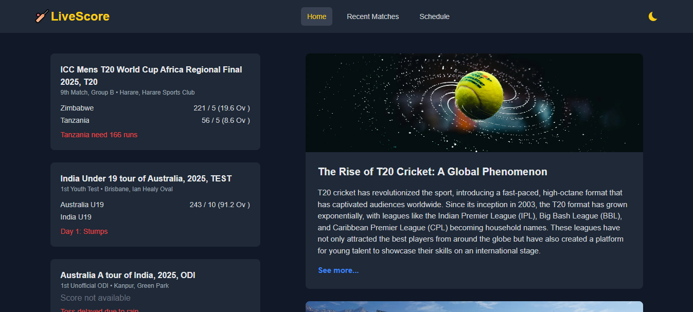

# Live Cricket Score App - Next.js

## 📑 Table of Contents

- [Description](#-description)
- [Tech Stack](#-tech-stack)
- [Features](#-features)
- [Setup and Installation](#-setup-and-installation)



## 📄 Description

I developed a Live Cricket Score Application using Next.js and the Cricbuzz API from RapidAPI. This app provides real-time cricket updates with a clean and responsive UI. It allows users to stay updated with live matches, recent results, upcoming fixtures, and cricket articles.

A scorecard section is also implemented to show detailed match score information. Since the free version of the Cricbuzz API allows only 100 requests per day, I optimized the features to cover the most important sections without overusing API calls.

## 💻 Tech Stack

- **`Frontend:`** Next.js 14, JavaScript, Tailwind CSS, React Icons, Axios
- **`API:`** Cricbuzz API (via RapidAPI)

## 🛠 Features

#### `Live Matches`

- Displays real-time cricket scores for ongoing matches.
- Includes international cricket coverage.

#### `Recent Matches`

- View recently finished matches with results.

#### `Upcoming Matches`

- Stay updated on upcoming fixtures.

#### `Scorecard Section`

- Provides detailed score breakdown for selected matches.

## 🚀 Setup and Installation

#### `Clone the Repository:`

```
https://github.com/Mohosin999/Live-Cricket-Score-App-Next.js.git
```

#### The End
